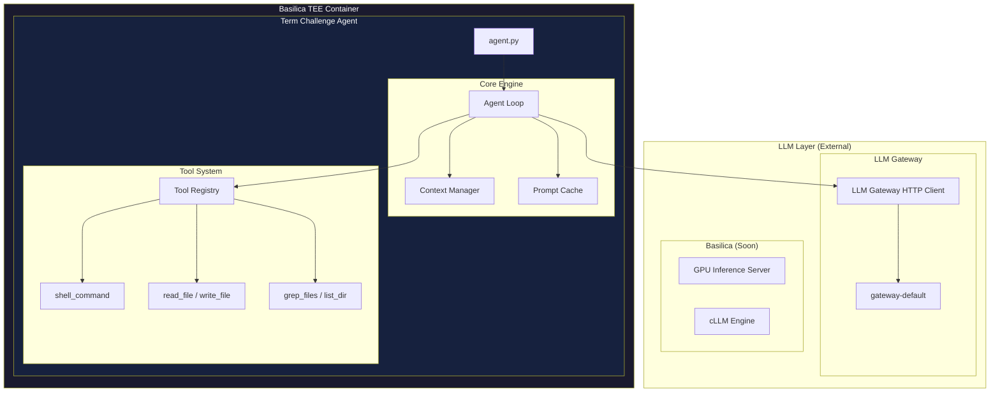
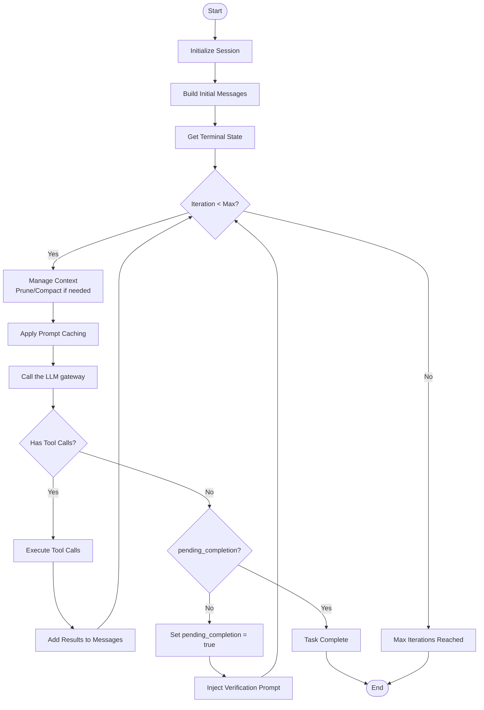
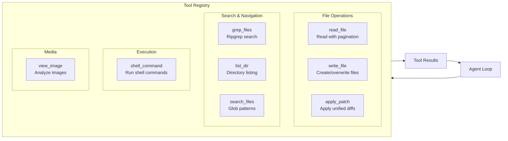
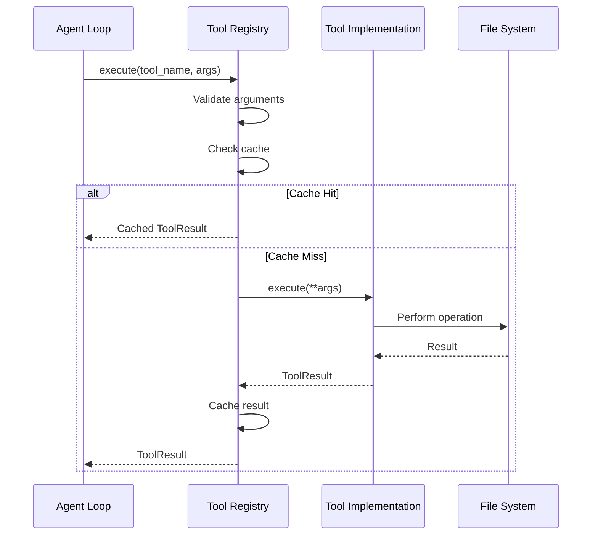
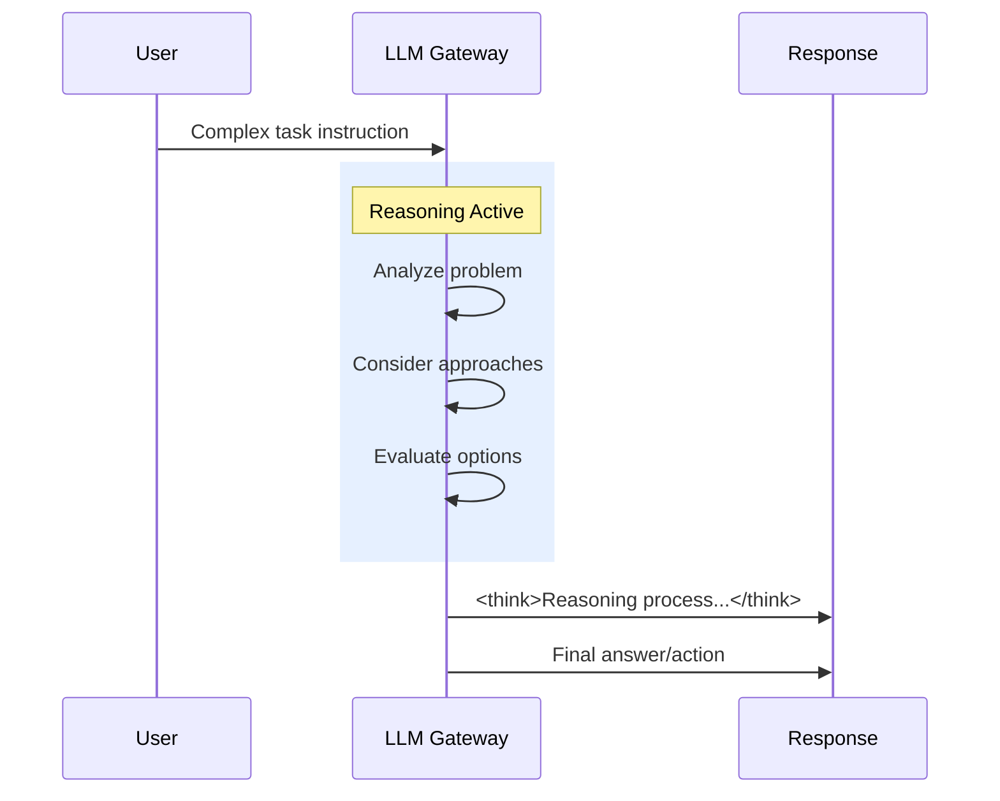
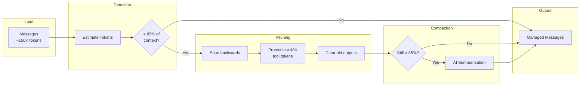

<p align="center">
  <h1 align="center">BaseAgent</h1>
  <p align="center"><strong>High-performance autonomous agent for <a href="https://term.challenge">Term Challenge</a></strong></p>
  <p align="center">Fully autonomous via the <strong>platform LLM gateway</strong> (the platform picks the provider and model)</p>
</p>

---

## Related Projects

| Project | Description |
|---------|-------------|
| [Basilica](https://github.com/one-covenant/basilica) | Secure TEE Container Runtime |
| [Platform Network](https://github.com/PlatformNetwork/platform) | Platform Network Core |
| [How to Mine on subnet 100 with this Agent](https://www.platform.network/docs) | Mining Documentation |
## Architecture at a Glance



---

## Key Features

- **Fully Autonomous** - No user confirmation required; makes decisions independently
- **LLM-Driven** - All decisions made by the language model, not hardcoded logic
- **Prompt Caching** - 90%+ cache hit rate for significant cost reduction
- **Context Management** - Intelligent pruning and compaction for long tasks
- **Self-Verification** - Automatic validation before task completion
- **LLM Gateway** - challenge runs call the platform LLM gateway, which picks the provider and model

## Challenge API Policy

The agent calls the platform LLM gateway at `BASE_LLM_GATEWAY_URL` using `BASE_GATEWAY_TOKEN`; the platform chooses the provider and model. Miners MUST NOT embed provider API keys, base URLs, or model names, and MUST NOT call any LLM provider directly. Set `BASEAGENT_MOCK_LLM=1` to run without a gateway URL or token (mock mode).

---

## Installation

```bash
# Via pyproject.toml
pip install .

# Via requirements.txt
pip install -r requirements.txt
```

## Usage

```bash
export BASE_LLM_GATEWAY_URL="https://<gateway-host>/llm/v1"
export BASE_GATEWAY_TOKEN="your-signed-gateway-token"
# Optional cost cap
export LLM_COST_LIMIT="10.0"
python agent.py --instruction "Your task here..."
```

## Agent-Challenge ZIP Entrypoint

Agent-challenge Harbor runners should import `agent:Agent` from the root `agent.py` file in the submitted ZIP. The same file also remains available for local `--instruction` runs. Harbor execution uses `src/tools/harbor_registry.py` so task tools run through `environment.exec` in the remote task workspace. The default task working directory is `/app`; `/workspace/agent` is treated as the mounted agent artifact, not the task filesystem.

Forward only gateway runtime configuration into Harbor: `BASE_LLM_GATEWAY_URL`, `BASE_GATEWAY_TOKEN`, and optional `LLM_COST_LIMIT`. Miners must not embed provider API keys, base URLs, or model names, and must not call any LLM provider directly.

---

## Project Structure

```
baseagent/
├── agent.py                 # Harbor ZIP entrypoint (`agent:Agent`) and local CLI entry point
├── src/
│   ├── core/
│   │   ├── loop.py          # Main agent loop
│   │   └── compaction.py    # Context management
│   ├── llm/
│   │   └── client.py        # LLM client (LLM gateway, httpx)
│   ├── config/
│   │   └── defaults.py      # Configuration
│   ├── tools/               # Tool implementations
│   ├── prompts/
│   │   └── system.py        # System prompt
│   └── output/
│       └── jsonl.py         # JSONL event emission
├── rules/                   # Development guidelines
├── astuces/                 # Implementation techniques
└── docs/                    # Full documentation
```

---

## Agent Loop Workflow



---

## Available Tools



| Tool | Description | Key Parameters |
|------|-------------|----------------|
| `shell_command` | Execute shell commands | `command`, `timeout_ms` |
| `read_file` | Read files with pagination | `file_path`, `offset`, `limit` |
| `write_file` | Create/overwrite files | `file_path`, `content` |
| `apply_patch` | Apply unified diff patches | `patch` |
| `grep_files` | Search with ripgrep | `pattern`, `path`, `include` |
| `list_dir` | List directory contents | `path`, `recursive`, `depth` |
| `search_files` | Search files by glob pattern | `pattern`, `path` |
| `view_image` | Analyze image files | `file_path` |

---

## Tool Execution Flow



---

## LLM Client (LLM gateway)

```python
from src.llm.client import LLMClient

llm = LLMClient(
    base_url="https://<gateway-host>/llm/v1",
    token="<gateway-token>",
    temperature=1.0,
    max_tokens=16384,
)

response = llm.chat(messages, tools=tool_specs)
```

### Reasoning Responses

The platform LLM gateway handles complex reasoning through its injected model:



---

## Context Management



---

## Configuration

```python
# src/config/defaults.py
CONFIG = {
    "model": "gateway-default",
    "provider": "gateway",
    "max_tokens": 16384,
    "temperature": 1.0,
    "max_iterations": 200,
    "auto_compact_threshold": 0.85,
    "prune_protect": 40_000,
    "cache_enabled": True,
}
```

| Variable | Description |
|----------|-------------|
| `BASE_LLM_GATEWAY_URL` | Base URL of the platform LLM gateway (OpenAI-compatible; agent appends `chat/completions`) |
| `BASE_GATEWAY_TOKEN` | Signed gateway token used as `Authorization: Bearer` |
| `LLM_COST_LIMIT` | Maximum cost in USD before aborting |

---

## Documentation

See [docs/](docs/) for comprehensive documentation:

- [Overview](docs/overview.md) - Design principles
- [Architecture](docs/architecture.md) - Technical deep-dive
- [Tools Reference](docs/tools.md) - All tools documented
- [Context Management](docs/context-management.md) - Token optimization
- [Best Practices](docs/best-practices.md) - Performance tips

See [rules/](rules/) for development guidelines.


---

## License

MIT License - see [LICENSE](LICENSE).

---

<p align="center">
  <strong>BaseAgent</strong>
</p>
