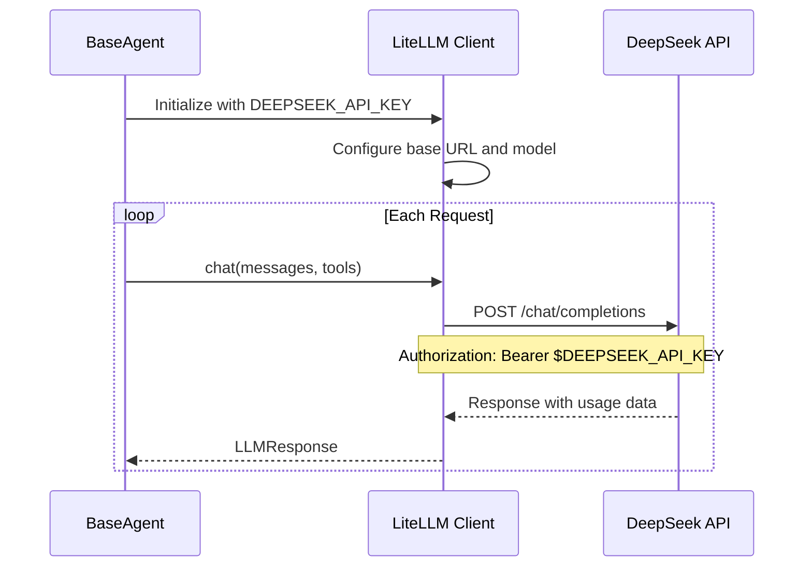

# DeepSeek API Integration

> **Using DeepSeek API as the challenge LLM path for BaseAgent**

## Overview

BaseAgent challenge runs are configured to use the DeepSeek API with `deepseek-v4-pro`. The file name remains `chutes-integration.md` so existing links keep working, but this page now documents DeepSeek setup only.

Challenge API policy: this agent is configured to use only the DeepSeek API for cost reasons. Challenge runs must use DEEPSEEK_API_KEY and the configured DeepSeek model. Do not add or rely on Chutes, OpenRouter, Anthropic, OpenAI, or other provider fallbacks for challenge execution.

---

## DeepSeek API Settings

| Setting | Value |
|---------|-------|
| **API Base URL** | `https://api.deepseek.com` |
| **Provider** | `deepseek` |
| **Model** | `deepseek-v4-pro` |
| **API Key Variable** | `DEEPSEEK_API_KEY` |

---

## Quick Setup

### Step 1: Get Your API Key

Create or use a DeepSeek API key for the challenge environment.

### Step 2: Configure Environment

```bash
export DEEPSEEK_API_KEY="your-token"
export DEEPSEEK_BASE_URL="https://api.deepseek.com"
export LLM_MODEL="deepseek-v4-pro"
```

### Step 3: Run BaseAgent

```bash
python3 agent.py --instruction "Your task description"
```

---

## Authentication Flow



---

## Configuration Options

### Basic Configuration

```python
# src/config/defaults.py
CONFIG = {
    "model": "deepseek-v4-pro",
    "provider": "deepseek",
    "base_url": "https://api.deepseek.com",
    "temperature": 1.0,
    "max_tokens": 16384,
}
```

### Environment Variables

| Variable | Required | Default | Description |
|----------|----------|---------|-------------|
| `DEEPSEEK_API_KEY` | Yes | none | API key for DeepSeek |
| `DEEPSEEK_BASE_URL` | Yes | `https://api.deepseek.com` | DeepSeek API base URL |
| `LLM_MODEL` | Yes | `deepseek-v4-pro` | Configured DeepSeek model |
| `LLM_COST_LIMIT` | No | `10.0` | Max cost in USD |

---

## API Request Format

DeepSeek uses an OpenAI-compatible API format:

```bash
curl -X POST https://api.deepseek.com/chat/completions \
  -H "Authorization: Bearer $DEEPSEEK_API_KEY" \
  -H "Content-Type: application/json" \
  -d '{
    "model": "deepseek-v4-pro",
    "messages": [
      {"role": "system", "content": "You are a helpful assistant."},
      {"role": "user", "content": "Hello!"}
    ],
    "max_tokens": 1024,
    "temperature": 1.0
  }'
```

---

## Cost Policy

Challenge runs use DeepSeek only for cost reasons. Keep the configuration on `DEEPSEEK_API_KEY`, `https://api.deepseek.com`, provider `deepseek`, and model `deepseek-v4-pro`.

Do not document or add fallback provider setup for challenge execution. If a DeepSeek request fails, fix the DeepSeek configuration or retry behavior rather than switching to another provider.

BaseAgent can still track usage and enforce a cost limit:

```bash
export LLM_COST_LIMIT="5.0"
```

---

## Troubleshooting

### Authentication Errors

```
LLMError: authentication_error
```

**Solution**: Verify the DeepSeek key is set and correct:

```bash
echo $DEEPSEEK_API_KEY
export DEEPSEEK_API_KEY="correct-token"
```

### Model Not Found

```
LLMError: Model 'xyz' not found
```

**Solution**: Use the configured model identifier:

```bash
export LLM_MODEL="deepseek-v4-pro"
```

### Connection Timeouts

```
LLMError: timeout
```

**Solution**: BaseAgent retries automatically. If the issue persists, check network access and confirm `DEEPSEEK_BASE_URL` is set to `https://api.deepseek.com`.

---

## Integration with LiteLLM

BaseAgent uses LiteLLM as the client layer while keeping challenge execution on DeepSeek:

```python
# src/llm/client.py
import litellm

litellm.api_base = "https://api.deepseek.com"

response = litellm.completion(
    model="deepseek-v4-pro",
    messages=messages,
    api_key=os.environ.get("DEEPSEEK_API_KEY"),
)
```

---

## Best Practices

1. Keep challenge runs on the fixed DeepSeek provider.
2. Keep `LLM_MODEL` set to `deepseek-v4-pro` unless the challenge configuration changes.
3. Use `LLM_COST_LIMIT` for local testing.
4. Do not add provider fallback instructions to challenge-facing docs.

---

## Next Steps

- [Configuration Reference](./configuration.md) - All settings explained
- [Best Practices](./best-practices.md) - Optimization tips
- [Usage Guide](./usage.md) - Command-line options
